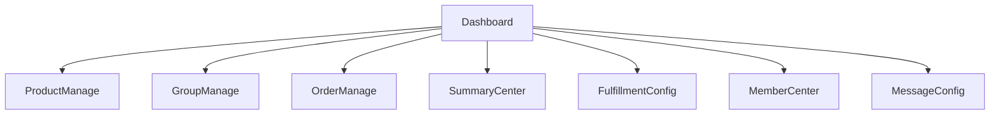

# 团购客饭接龙后台管理最小页面原型与功能拆分

## 1. 目标

为商家管理员与团长提供一套最小可用后台，支持商品配置、团购活动管理、订单履约、汇总导出、会员营销与通知配置。

MVP 原则：

- 优先保证业务闭环跑通。
- 页面少而清晰，避免复杂 ERP 化。
- 团长端与管理员端尽量复用页面，依赖权限做按钮控制。

## 2. 后台信息架构

## 3. 菜单结构建议

### 3.1 一级菜单

- 仪表盘
- 商品管理
- 团活动管理
- 订单管理
- 汇总中心
- 履约配置
- 会员营销
- 消息配置
- 用户与权限

### 3.2 二级菜单

#### 商品管理

- 商品列表
- 分类管理（可选）

#### 团活动管理

- 团列表
- 发起团
- 团模板

#### 订单管理

- 全部订单
- 待履约订单
- 异常订单

#### 汇总中心

- 商品汇总
- 自提汇总
- 配送汇总

#### 履约配置

- 自提点管理
- 时间段配置
- 配送区域配置

#### 会员营销

- 优惠券管理
- 发券记录
- 积分规则
- 积分流水

#### 消息配置

- 模板配置
- 发送记录

#### 用户与权限

- 用户列表
- 团长管理
- 管理员角色

## 4. 核心页面原型说明

## 4.1 仪表盘

### 页面目标

帮助管理员快速查看当天团购运营情况。

### 模块布局

#### 顶部指标卡

- 进行中团数
- 今日订单数
- 今日销售额
- 待履约订单数
- 今日已完成订单数
- 缺货异常数

#### 中部图表

- 近 7 天订单趋势
- 团状态分布
- 热销商品 TOP 10

#### 底部快捷入口

- 发起新团
- 查看待截单团
- 查看待取餐订单
- 查看配送中订单

### MVP 功能

- 展示核心汇总数据
- 支持跳转到相关列表页

## 4.2 商品管理页

### 页面目标

完成菜品、套餐、规格与库存基础维护。

### 页面结构

#### 筛选栏

- 关键词
- 类目
- 状态（上架/下架）

#### 列表字段

- 商品图
- 商品名称
- 类目
- SKU 数量
- 起售价
- 状态
- 更新时间
- 操作

#### 操作按钮

- 新建商品
- 编辑
- 上下架
- 查看规格

### 商品编辑抽屉/弹窗字段

- 商品名称
- 副标题
- 封面图
- 类目
- 描述
- SKU 列表
  - 规格名称
  - 规格编码
  - 售价
  - 原价
  - 总库存
  - 每人限购
  - 每单限购

### MVP 功能范围

- 商品增删改查
- SKU 增删改查
- 商品上下架

## 4.3 团列表页

### 页面目标

查看所有团活动并执行运营动作。

### 筛选项

- 团状态
- 团长
- 时间范围
- 关键词

### 列表字段

- 团标题
- 团长
- 开团时间
- 截单时间
- 状态
- 接龙人数
- 订单数
- 销售额
- 履约方式
- 操作

### 行操作

- 查看详情
- 编辑
- 截单
- 复制分享链接
- 查看汇总
- 结束团

## 4.4 发起团页

### 页面目标

让团长或管理员在后台快速创建活动。

### 页面布局

#### 基本信息区

- 团标题
- 团封面
- 团说明
- 团模板选择

#### 时间配置区

- 开团时间
- 截单时间

#### 履约配置区

- 履约方式
- 自提点多选
- 配送区域多选
- 时间段配置

#### 商品配置区

- 添加商品
- 设置团内价格
- 设置团内库存
- 设置限购规则

#### 其他配置区

- 是否允许改单
- 是否显示接龙明细

### 页面底部按钮

- 保存草稿
- 立即发布

## 4.5 团详情/团管理页

### 页面目标

对单个团进行运营与履约控制。

### 页面结构

#### 顶部信息卡

- 团状态
- 团名称
- 截单时间
- 团长
- 履约方式
- 分享入口

#### 统计卡

- 接龙人数
- 订单数
- 销售额
- 待履约数

#### 选项卡

- 订单列表
- 商品汇总
- 自提汇总
- 配送汇总
- 操作日志

#### 顶部操作按钮

- 手动截单
- 一键通知
- 导出汇总
- 标记履约开始

## 4.6 订单管理页

### 页面目标

统一查看、筛选和操作订单。

### 筛选项

- 订单状态
- 团活动
- 履约方式
- 自提点
- 时间范围
- 关键词（订单号/手机号/昵称）

### 列表字段

- 订单号
- 团名称
- 用户昵称
- 手机号
- 商品摘要
- 金额
- 履约方式
- 下单时间
- 当前状态
- 操作

### 行操作

- 查看详情
- 标记待取餐
- 标记配送中
- 标记完成
- 异常处理

## 4.7 订单详情弹窗/详情页

### 区块设计

- 基本信息
- 商品明细
- 金额明细
- 优惠券信息
- 履约信息
- 状态时间轴
- 操作记录

### 异常处理能力

- 标记缺货
- 替换商品
- 减项处理
- 补发优惠券
- 添加备注

## 4.8 汇总中心

### 页面目标

为备餐、拣货、履约提供结构化统计视图。

### Tab 设计

#### 商品汇总

字段：

- 商品名称
- SKU
- 数量合计
- 备注摘要

#### 自提汇总

字段：

- 自提点
- 时间段
- 订单数
- 商品总数

#### 配送汇总

字段：

- 配送区域
- 订单数
- 商品总数
- 地址明细导出

### 功能

- 导出 CSV
- 打印友好视图
- 按团过滤

## 4.9 自提点管理页

### 列表字段

- 自提点名称
- 联系人
- 联系电话
- 地址
- 营业时间
- 状态
- 操作

### 编辑字段

- 名称
- 联系人
- 电话
- 地址
- 营业时间
- 时间段列表

## 4.10 配送区域配置页

### 列表字段

- 区域名称
- 地址关键字
- 运费
- 起送金额
- 状态
- 操作

### MVP 功能

- 新增区域
- 编辑区域
- 启停用

## 4.11 优惠券管理页

### 列表字段

- 券名称
- 券类型
- 面额/折扣
- 门槛
- 适用范围
- 生效时间
- 状态
- 已发放/总量
- 操作

### 编辑字段

- 券名称
- 券类型
- 面额
- 门槛
- 适用范围
- 有效期
- 每人限领
- 总数量

### 额外功能

- 手动发券
- 查看领取记录

## 4.12 积分规则页

### 页面内容

- 下单赠送规则
- 完成订单赠送规则
- 手工调整入口
- 积分流水查看

### MVP 建议

- 只支持按实付金额比例赠送积分
- 支持手工增减积分

## 4.13 消息模板配置页

### 列表字段

- 场景编码
- 场景名称
- 模板 ID
- 启用状态
- 最近发送时间
- 操作

### 页面功能

- 配置模板 ID
- 启停用
- 查看发送记录
- 查看失败原因统计

## 4.14 用户与权限页

### 用户列表字段

- 用户昵称
- 手机号
- 角色
- 状态
- 创建时间
- 操作

### 角色功能

- 设置团长
- 取消团长
- 设置管理员
- 禁用账号

## 5. 权限拆分建议

## 5.1 管理员权限

- 全量商品管理
- 全量团活动管理
- 全量订单操作
- 会员营销配置
- 模板配置
- 权限管理

## 5.2 团长权限

- 仅查看和管理自己创建的团
- 可发起团
- 可查看本团订单、汇总
- 可手动截单
- 可执行通知与部分履约操作
- 无权调整平台级商品与券规则

## 6. 页面优先级建议

### P0 页面

- 商品管理
- 发起团
- 团列表/团管理
- 订单管理
- 汇总中心
- 自提点管理

### P1 页面

- 配送区域配置
- 优惠券管理
- 积分规则
- 消息模板配置

### P2 页面

- 用户与权限
- 高级报表
- 操作日志

## 7. 前端实现建议

如果继续沿用 `admin-web`：

- 技术栈建议使用 React + Ant Design
- 布局采用左侧菜单 + 顶部面包屑
- 列表页统一采用表格 + 筛选表单 + 抽屉编辑
- 汇总页可增加打印样式与导出按钮

## 8. 最小后台上线验收标准

- 可创建商品与 SKU。
- 可创建团活动并配置截单时间。
- 可查看团订单并执行截单。
- 可查看商品/自提/配送汇总并导出。
- 可配置自提点与时间段。
- 可管理至少一种优惠券与积分规则。
- 可配置消息模板并查看发送记录。
